<p align="center">
  
</p>

<h1 align="center">mailpilot</h1>

<p align="center">
  <b>Push-style AI email assistant in a single Go binary.</b><br>
  New mail → LLM → your phone. Self-hosted, real-time, zero runtime dependencies.
</p>

<p align="center">
  <a href="https://github.com/Wangnov/mailpilot/actions/workflows/ci.yml"></a>
  <a href="https://github.com/Wangnov/mailpilot/releases/latest"></a>
  <a href="go.mod"></a>
  <a href="LICENSE"></a>
  
  
  
</p>

<p align="center">
  <a href="#readme-zh">中文</a> · <a href="#readme-en">English</a>
</p>

<p align="center">
  IMAP IDLE · bounded history · image OCR · Bark / Telegram / ntfy / Webhook · prompt-injection hardened · cross-compiled
</p>

---

<a id="readme-zh"></a>

## 🇨🇳 中文

`mailpilot` 盯着你的收件箱，通过 **IMAP IDLE** 在新邮件到达的那一刻，把它丢给一个 LLM（你的 ChatGPT 订阅经 `codex`、任意 OpenAI 兼容 API、Google Gemini，或本地 Ollama），再把结构化摘要（**分类 · 紧急度 · 一句话 · 关键点**）经 **Bark / Telegram / ntfy / Webhook** 秒级推到你手机。

一个 `scp` 上去就能跑的静态二进制 —— 目标机 **不需要 Python / pip / venv**。goroutine 驱动的 IMAP IDLE 带来秒级延迟。

### ✨ 特性

- 📦 **单静态二进制** — `go build` 出一个文件；`make cross` 出 linux/amd64·arm64、darwin/arm64…
- ⚡ **实时** — IMAP IDLE（goroutine），秒级而非轮询
- 🧠 **多 provider 自动降级** — `codex`（订阅）→ `openai`/兼容端点 → `gemini` → `ollama`（本地）
- 🔎 **有边界的历史检索** — 当邮件像是某讨论串 / issue 的后续时，`openai` provider 用内置 function-calling 循环做只读历史检索；`codex` 默认单轮分析，不继承邮件/通知密钥环境。
- 🖼️ **图片邮件 OCR** — 正文为空的纯图片邮件 → 先过 PaddleOCR 再分析
- 📱 **智能多渠道推送** — 紧急→破防+声音，垃圾/营销→静默，验证码→模型提取后可复制，点按→打开邮件主链接（无主链接则回退 Gmail），按分类归组
- ♻️ **可靠** — 去重水位线 + 重试队列 + 首跑基线 + IDLE 断线自动重连
- 🔒 **安全** — 只读 IMAP，邮件正文视为不可信，prompt-injection 硬化；`codex` 被关进项目内只读一次性沙箱

### 🚀 快速开始

```bash
go install github.com/Wangnov/mailpilot@latest
# 或从源码构建：
git clone https://github.com/Wangnov/mailpilot && cd mailpilot && make build
make cross           # 给服务器出静态二进制 → dist/mailpilot-linux-arm64 等
```

```bash
mailpilot init                 # 生成 config.yaml
$EDITOR config.yaml            # IMAP + 一个 provider + 一个通知渠道
export IMAP_PASSWORD=...  OPENAI_API_KEY=...  BARK_KEY=...
mailpilot run                  # 处理一次（适合 cron 兜底）
mailpilot daemon               # 常驻 IMAP IDLE（实时）
```

> 首次运行只记录水位线，**不会**把你的存量邮件全推一遍。

### 📮 去哪拿邮箱 IMAP 授权码？

各家邮箱**不能直接用登录密码**，要单独生成「应用专用密码 / 授权码」，再填进 `config.yaml` 的 `imap.password`。点开你的邮箱：

<details>
<summary><b>Gmail</b> &nbsp;·&nbsp; <code>imap.gmail.com</code></summary>

1. 开启两步验证：[myaccount.google.com](https://myaccount.google.com) → 安全性 → 两步验证
2. 生成应用专用密码：安全性 → 应用专用密码 → 选「邮件」→ 生成 → 复制那 16 位
3. 确认 IMAP 已开：Gmail 设置 → 「转发和 POP/IMAP」→ 启用 IMAP
4. 把 16 位填进 `password`（空格可留可去），`host: imap.gmail.com`
</details>

<details>
<summary><b>QQ 邮箱</b> &nbsp;·&nbsp; <code>imap.qq.com</code></summary>

1. 网页版 → 设置 → 账户 → 找到「POP3/IMAP/SMTP… 服务」
2. 开启 **IMAP/SMTP 服务**，按提示发一条短信验证
3. 拿到**授权码**（不是 QQ 密码）填进 `password`，`host: imap.qq.com`
</details>

<details>
<summary><b>163 / 126 邮箱</b> &nbsp;·&nbsp; <code>imap.163.com</code></summary>

1. 网页版 → 设置 → 「POP3/SMTP/IMAP」
2. 开启 **IMAP/SMTP 服务**，设置一个**客户端授权密码**
3. 授权密码填 `password`，`host: imap.163.com`（126 用 `imap.126.com`）
</details>

<details>
<summary><b>Outlook / Microsoft 365</b> &nbsp;·&nbsp; <code>outlook.office365.com</code></summary>

1. 开启两步验证：[account.microsoft.com/security](https://account.microsoft.com/security)
2. 高级安全选项 → 应用密码 → 新建 → 复制
3. 应用密码填 `password`，`host: outlook.office365.com`
</details>

> 拿到后建议放进环境变量（`export IMAP_PASSWORD=...`）再用 `${IMAP_PASSWORD}` 引用，别明文写进 `config.yaml`。

### ⚙️ 配置

```yaml
imap:
  host: imap.gmail.com
  user: you@gmail.com
  password: ${IMAP_PASSWORD}     # Gmail：应用专用密码
  force_ipv4: true               # 本机 IPv6 出站不通时打开

analyze:
  providers:                     # 按序尝试；失败/限流 → 下一个
    - type: codex                # 你的 ChatGPT 订阅（需本机装 codex CLI）
      model: gpt-5.3-codex-spark
    - type: openai               # OpenAI 或任意兼容端点
      model: gpt-5.4-mini
      base_url: https://api.openai.com/v1
      api_key: ${OPENAI_API_KEY}
    # - type: ollama             # 全本地、隐私、零成本
    #   model: qwen2.5
    #   base_url: http://localhost:11434
    # - type: gemini             # Google Gemini(官方 Go SDK)
    #   model: gemini-3.1-flash-lite
    #   api_key: ${GEMINI_API_KEY}
  timeout: 300
  language: 中文                 # 通知语言：中文 / English / 日本語…；auto=随邮件本身语言

ocr:
  enabled: true
  type: paddle                    # 当前内置 PaddleOCR；后续可扩展其它 OCR 引擎
  token: ${PADDLEOCR_TOKEN}

notify:
  - type: bark
    key: ${BARK_KEY}
    # icon: https://your.cdn/icon.png   # 推送图标；省略=内置 mailpilot logo，设为 "" 关闭
  # - type: telegram
  #   bot_token: ${TG_BOT_TOKEN}
  #   chat_id: ${TG_CHAT_ID}
  # - type: ntfy
  #   topic: my-mail
  # - type: webhook
  #   url: ${WEBHOOK_URL}
  #   format: wecom              # 可选：generic / wecom / slack；常见企业微信/Slack URL 会自动识别

pipeline:
  baseline_on_first_run: true
  history_search: true
  # skip_categories: [垃圾, 营销推广]   # 命中的分类只分析、不推送；默认全部推送
  # scan_spam: true                    # 兜底扫垃圾箱，救回被 Gmail 误判进垃圾箱的正常邮件
```

`${ENV}` 在 YAML **解析后**对字符串字段展开，因此密钥里含 `: # "` 等特殊字符也不会破坏解析。

### 🧠 Provider 与降级

- **`codex`** — 你的 ChatGPT 订阅，经 Codex CLI（`codex exec`）。省 API 费但可能被限流，**永远把 `openai`/`ollama` 排在它后面**。默认单轮分析，不开放历史检索工具。运行**被收进项目内只读一次性沙箱**：`--ephemeral`（不往 `~/.codex` 落 session）、临时产物只在 `<config 目录>/.mailpilot-work/` 且随用随清、子进程不继承 `IMAP_PASSWORD`/`OPENAI_API_KEY`/通知密钥等邮件运行时环境，且不开放沙箱网络。
- **`openai`** — OpenAI 或任意兼容端点（`base_url`）。**用内置 function-calling 循环做 agentic 历史检索**：模型多轮调用 `mail_search`，最后一次 json-schema 强约束出结构化结果。可靠的主力。
- **`ollama`** — 全本地、私有、零成本。单轮（本地模型工具调用能力参差）；要历史检索用 `openai`。
- **`gemini`** — Google Gemini，官方 Go SDK（原生格式），结构化输出走 `responseSchema`，`api_key` 填 Gemini API key。单轮（无 agentic 历史）。

### 🔎 受限历史检索（不挂框架）

`tool-search` 是**同一个二进制**的隐藏子命令 —— 只读 IMAP 的 search/get/thread。`openai` 的 function-calling 循环在同一封邮件的总超时预算内 shell 出去调它；`codex` 出于不可信邮件安全边界默认不拿历史工具。于是这一个二进制**同时是 daemon、又是受限历史检索工具**。没有 agent 框架，没有额外服务。

### 📱 推送

按分析结果智能映射渠道能力：紧急→破防+声音、垃圾→静默、验证码→模型提取后可复制（支持字母数字混合码）、点按→打开邮件主链接（无主链接则回退 Gmail）、按分类归组。开箱支持 **Bark / Telegram / ntfy / Webhook**；Webhook 支持 `generic` / `wecom` / `slack` 格式，常见企业微信和 Slack URL 会自动识别。Bark 默认用 mailpilot 的 logo 作推送图标，可用 `notify[].icon` 改 URL，或设为空串关闭。

**垃圾 / 营销邮件**：`垃圾`、`营销推广`、`低` 默认走**静音**推送（仍进通知中心、不响铃）；想彻底不推某些分类，配 `pipeline.skip_categories: [垃圾, 营销推广]`（这些邮件仍会被分析，只是不推）。

注意我们只扫 `INBOX`：Gmail 自己判定的垃圾邮件本就不在 `INBOX`。反过来，**Gmail 误杀进垃圾箱的真邮件，默认你也收不到通知**——担心这点就开 `pipeline.scan_spam: true` 兜底扫垃圾箱，仅当 LLM 判定它【不是】垃圾/营销时才推一条「可能误判」提醒（成本随垃圾量上升）。

**通知语言**：正文（摘要 / 要点 / 建议）的语言由 `analyze.language` 决定，默认 `中文`，可设 `English` / `日本語` 等，或 `auto`(随邮件本身语言)。`category` / `urgency` 是供逻辑判断的稳定枚举键（保持中文），与显示语言无关。

### 🚢 部署

```bash
scp dist/mailpilot-linux-arm64 server:/usr/local/bin/mailpilot   # 一个文件，零依赖
sudo cp deploy/mailpilot.service /etc/systemd/system/
# 如果 config.yaml 使用 ${ENV}，可在 /home/ubuntu/mailpilot/.env 写入这些环境变量；该文件是可选的。
sudo systemctl enable --now mailpilot
sudo journalctl -u mailpilot -f
```

### 🔒 安全

只读 IMAP（应用专用密码，绝不发信/删信）；邮件正文视为**不可信**：包裹进结构标记、中和正文伪造的越狱标记、提示词禁止执行正文里的任何指令——链接**原样保留**以便判断内容真伪。判真伪不写死规则，而是**复用 Gmail 已有的收件箱/垃圾箱信号**作提示。`codex` 子进程**被收进项目内**：只读一次性沙箱（写不到你的 `config.yaml`/`.env`）、`--ephemeral` 不在 `~/.codex` 堆积、不动你的 codex 配置、不继承邮件/通知/API 密钥环境、不开放沙箱网络。所有凭据可吊销。

### 🛠 构建与发布

```bash
make build        # 当前平台
make cross        # linux/amd64·arm64 + darwin/arm64·amd64 → dist/
make test         # go test -race ./...
make vet
make ci           # vet + race test + build + cross
```

打 `v*` tag 即触发 GitHub Actions **Release** workflow：先确认 tag commit 在 `main` 上并跑 `go vet` / `go test -race`，再交叉编译四平台静态二进制、生成 `SHA256SUMS.txt`、发布 GitHub Release。

```bash
git tag v0.2.0 && git push origin v0.2.0
```

### 📄 License

MIT © 2026 wangnov

---

<a id="readme-en"></a>

## 🇬🇧 English

`mailpilot` watches your inbox over **IMAP IDLE** and, the moment a new email arrives, runs it through an LLM (your ChatGPT subscription via `codex`, any OpenAI-compatible API, Google Gemini, or a local Ollama model), then pushes a structured summary (**category · urgency · one-line · key points**) to your phone via **Bark / Telegram / ntfy / Webhook**.

One static binary you `scp` and run — **no Python / pip / venv on the target host**. goroutine-based IMAP IDLE for second-level latency.

### ✨ Features

- 📦 **Single static binary** — `go build` → one file; `make cross` → linux/amd64·arm64, darwin/arm64…
- ⚡ **Real-time** — IMAP IDLE (goroutine), seconds not polling
- 🧠 **Multi-provider with fallback** — `codex` (subscription) → `openai`/compatible → `gemini` → `ollama` (local)
- 🔎 **Bounded history lookup** — when a mail looks like a thread/issue reply, the `openai` provider uses a built-in function-calling loop for read-only history lookup; `codex` defaults to single-shot analysis and does not inherit mail or notifier secrets.
- 🖼️ **Image emails OCR'd** — empty-body image mail → PaddleOCR before analysis
- 📱 **Smart multi-channel push** — urgent→break-through+sound, spam→silent, LLM-extracted codes→copyable, tap→open the mail's primary link (fallback to Gmail), grouped by category
- ♻️ **Reliable** — dedup watermark + retry queue + first-run baseline + IDLE auto-reconnect
- 🔒 **Safe** — read-only IMAP, body treated as untrusted, prompt-injection hardened; `codex` confined to a throwaway project-local read-only sandbox

### 🚀 Quick start

```bash
go install github.com/Wangnov/mailpilot@latest
# or from source:
git clone https://github.com/Wangnov/mailpilot && cd mailpilot && make build
make cross           # static binaries for your server → dist/mailpilot-linux-arm64, etc.
```

```bash
mailpilot init                 # writes config.yaml
$EDITOR config.yaml            # IMAP + one provider + one notifier
export IMAP_PASSWORD=...  OPENAI_API_KEY=...  BARK_KEY=...
mailpilot run                  # process once (cron-friendly)
mailpilot daemon               # stay resident on IMAP IDLE (real-time)
```

> First run only records a watermark and does **not** push your existing backlog.

### 📮 Where to get your IMAP password

Most providers **don't accept your login password** — generate a dedicated "app password / authorization code" and put it in `imap.password`. Expand your provider:

<details>
<summary><b>Gmail</b> &nbsp;·&nbsp; <code>imap.gmail.com</code></summary>

1. Enable 2-Step Verification: [myaccount.google.com](https://myaccount.google.com) → Security → 2-Step Verification
2. Generate an App Password: Security → App passwords → pick "Mail" → Generate → copy the 16 chars
3. Make sure IMAP is on: Gmail Settings → "Forwarding and POP/IMAP" → Enable IMAP
4. Put the 16 chars in `password` (spaces optional), `host: imap.gmail.com`
</details>

<details>
<summary><b>QQ Mail</b> &nbsp;·&nbsp; <code>imap.qq.com</code></summary>

1. Web UI → Settings → Account → find "POP3/IMAP/SMTP… service"
2. Enable **IMAP/SMTP**, verify by SMS as prompted
3. Use the generated **authorization code** (not your QQ password) as `password`, `host: imap.qq.com`
</details>

<details>
<summary><b>163 / 126 Mail</b> &nbsp;·&nbsp; <code>imap.163.com</code></summary>

1. Web UI → Settings → "POP3/SMTP/IMAP"
2. Enable **IMAP/SMTP**, set a **client authorization password**
3. Use that auth password as `password`, `host: imap.163.com` (126 uses `imap.126.com`)
</details>

<details>
<summary><b>Outlook / Microsoft 365</b> &nbsp;·&nbsp; <code>outlook.office365.com</code></summary>

1. Enable 2-step verification: [account.microsoft.com/security](https://account.microsoft.com/security)
2. Advanced security options → App passwords → Create → copy
3. Use the app password as `password`, `host: outlook.office365.com`
</details>

> Prefer an env var (`export IMAP_PASSWORD=...`) referenced via `${IMAP_PASSWORD}` over hardcoding it in `config.yaml`.

### ⚙️ Configuration

```yaml
imap:
  host: imap.gmail.com
  user: you@gmail.com
  password: ${IMAP_PASSWORD}     # Gmail: App Password
  force_ipv4: true               # set if your host's IPv6 egress is broken

analyze:
  providers:                     # tried in order; failure/rate-limit → next
    - type: codex                # your ChatGPT subscription (needs codex CLI)
      model: gpt-5.3-codex-spark
    - type: openai               # OpenAI or any compatible endpoint
      model: gpt-5.4-mini
      base_url: https://api.openai.com/v1
      api_key: ${OPENAI_API_KEY}
    # - type: ollama             # fully local, private, zero-cost
    #   model: qwen2.5
    #   base_url: http://localhost:11434
    # - type: gemini             # Google Gemini (official Go SDK)
    #   model: gemini-3.1-flash-lite
    #   api_key: ${GEMINI_API_KEY}
  timeout: 300
  language: English             # notification language: 中文 / English / 日本語…; auto = match the email

ocr:
  enabled: true
  type: paddle                    # built-in PaddleOCR for now; other OCR engines can be added
  token: ${PADDLEOCR_TOKEN}

notify:
  - type: bark
    key: ${BARK_KEY}
    # icon: https://your.cdn/icon.png   # push icon; omit = built-in mailpilot logo, "" to disable
  # - type: telegram
  #   bot_token: ${TG_BOT_TOKEN}
  #   chat_id: ${TG_CHAT_ID}
  # - type: ntfy
  #   topic: my-mail
  # - type: webhook
  #   url: ${WEBHOOK_URL}
  #   format: wecom              # optional: generic / wecom / slack; common WeCom/Slack URLs auto-detect

pipeline:
  baseline_on_first_run: true
  history_search: true
  # skip_categories: [垃圾, 营销推广]   # only analyze, don't push these categories; default pushes all
  # scan_spam: true                    # also sweep the Spam folder to rescue mail Gmail mis-filed there
```

`${ENV}` is expanded on parsed string fields **after** YAML parsing, so secrets containing `: # "` etc. can't break parsing.

### 🧠 Providers & fallback

- **`codex`** — your ChatGPT subscription via the Codex CLI (`codex exec`). Saves API spend but can be rate-limited — **always put `openai`/`ollama` after it**. Defaults to single-shot analysis without history tools. Runs **confined**: `--ephemeral` (no session files in `~/.codex`), temp artifacts only under `<config-dir>/.mailpilot-work/` and auto-cleaned, no inherited mail/notifier/API key environment, read-only sandbox, and no sandbox network.
- **`openai`** — OpenAI or any compatible endpoint (`base_url`). **Does agentic history search via a built-in function-calling loop**: the model calls `mail_search` over several rounds, then a final json-schema call produces strict structured output. The reliable workhorse.
- **`ollama`** — fully local, private, zero-cost. Single-shot (local models' tool-calling varies); use `openai` for history lookup.
- **`gemini`** — Google Gemini via the official Go SDK (native format); structured output through `responseSchema`, put your Gemini API key in `api_key`. Single-shot (no agentic history).

### 🔎 How bounded history works (no framework)

`tool-search` is a hidden subcommand of the **same binary** — a read-only IMAP search/get/thread. The `openai` function-calling loop shells out to it within the same per-email timeout budget; `codex` does not receive the history tool by default because email content is untrusted. So the one binary is simultaneously the daemon *and* a bounded history lookup tool. No agent framework, no extra service.

### 📱 Push

Channel capabilities are mapped from the analysis: urgent→break-through+sound, spam→silent, LLM-extracted codes→copyable (including alphanumeric codes), tap→open the mail's primary link (fallback to Gmail), grouped by category. Ships with **Bark / Telegram / ntfy / Webhook**; Webhook supports `generic` / `wecom` / `slack`, with common WeCom and Slack URLs auto-detected. Bark uses the mailpilot logo as the default push icon — override the URL via `notify[].icon`, or set an empty string to disable.

**Spam / marketing:** `垃圾`, `营销推广`, and `低` default to **silent** pushes (still in Notification Center, no alert); to drop certain categories entirely, set `pipeline.skip_categories: [垃圾, 营销推广]` (those mails are still analyzed, just not pushed).

We only scan `INBOX`: Gmail's own spam never reaches it. The flip side — **a real email Gmail mis-files into Spam won't notify you by default.** If that worries you, set `pipeline.scan_spam: true` to also sweep the Spam folder; it pushes a "[possible misfile]" alert only when the LLM judges the message is NOT junk (cost scales with spam volume).

**Notification language:** the free text (summary / key points / action) follows `analyze.language` (default `中文`; set `English` / `日本語`, or `auto` to match the email). `category` / `urgency` are stable internal enum keys (kept in Chinese for the matching logic) and are independent of the display language.

### 🚢 Deploy

```bash
scp dist/mailpilot-linux-arm64 server:/usr/local/bin/mailpilot   # one file, no deps
sudo cp deploy/mailpilot.service /etc/systemd/system/
# If config.yaml references ${ENV}, write those variables to /home/ubuntu/mailpilot/.env; that file is optional.
sudo systemctl enable --now mailpilot
sudo journalctl -u mailpilot -f
```

### 🔒 Security

Read-only IMAP (App Password, never sends/deletes); email bodies treated as **untrusted**: wrapped in structural delimiters, in-body jailbreak markers neutralized, prompt forbids executing any in-body instructions, and URLs are kept intact for content judgment. Authenticity isn't judged by hardcoded rules but by **reusing Gmail's existing inbox/spam signals** as hints. The `codex` subprocess is **confined to the project**: a throwaway read-only sandbox (writes can't reach your `config.yaml`/`.env`), `--ephemeral` so nothing accumulates in `~/.codex`, no inherited mail/notifier/API key environment, no sandbox network, and your codex config left untouched. All credentials revocable.

### 🛠 Build & release

```bash
make build        # current platform
make cross        # linux/amd64·arm64 + darwin/arm64·amd64 → dist/
make test         # go test -race ./...
make vet
make ci           # vet + race test + build + cross
```

Pushing a `v*` tag triggers the GitHub Actions **Release** workflow: first verify the tag commit is on `main` and run `go vet` / `go test -race`, then cross-compile four static binaries, emit `SHA256SUMS.txt`, and publish a GitHub Release.

```bash
git tag v0.2.0 && git push origin v0.2.0
```

### 📄 License

MIT © 2026 wangnov
